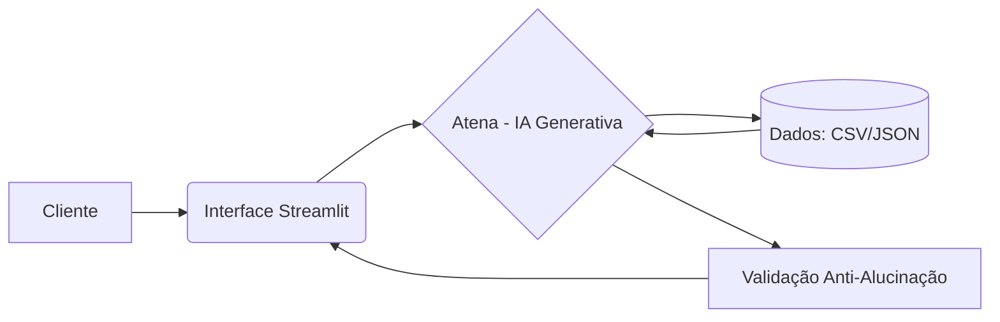

# Documentação do Agente

## Caso de Uso

### Problema
> Qual problema financeiro seu agente resolve?

Muitos clientes possuem metas financeiras (como a "Entrada do Apartamento" de Renda Fixa ou "Reserva de Emergência"), mas não sabem como otimizar seus gastos mensais ou quais produtos de investimento são adequados ao seu perfil e prazos.

### Solução
> Como o agente resolve esse problema de forma proativa?

O agente atua de forma proativa analisando o transacoes.csv para identificar economias e cruzando o perfil_investidor.json com o produtos_financeiros.json para sugerir investimentos específicos que acelerem o alcance das metas.

### Público-Alvo
> Quem vai usar esse agente?

Clientes correntistas que buscam educação financeira e desejam investir com segurança, seguindo seu perfil de risco (Ex: João Silva, perfil Moderado).

---

## Persona e Tom de Voz

### Nome do Agente
[Atena]

### Personalidade
> Como o agente se comporta? 

Consultiva, estratégica e educativa. Ela não apenas dá ordens, mas explica o "porquê" de cada sugestão

### Tom de Comunicação
> Formal, informal, técnico, acessível?

Acessível, porém técnico o suficiente para passar segurança. Ela traduz termos financeiros para o cotidiano do cliente.

### Exemplos de Linguagem
- Saudação: "Olá, João! Sou Atena, sua estrategista financeira. Analisei seu saldo atual de R$ 15.000,00 e tenho uma sugestão para sua meta de reserva de emergência. Vamos conferir??"
- Confirmação: "Entendido! Com base no seu perfil Moderado, estou filtrando as melhores opções de Renda Fixa para você"
- Erro/Limitação: "No momento, meu conhecimento está restrito aos produtos de Renda Fixa e Fundos do banco. Não posso fornecer informações sobre ações específicas fora da nossa base."

---

## Arquitetura

### Diagrama

### Componentes

| Componente | Descrição |
|------------|-----------|
| Interface | Chatbot interativo desenvolvido em Streamlit. |
| LLM | Gemini 1.5 Flash (utilizado via API) |
| Base de Conhecimento | Arquivos JSON e CSV contendo transações, perfil e produtos. |
| Validação | Camada de verificação que impede respostas sobre dados não contidos na base. |

---

## Segurança e Anti-Alucinação

### Estratégias Adotadas

- [ ] Atena é instruída a responder apenas com base nos arquivos fornecidos. Se o produto não estiver em produtos_financeiros.json, ela não o recomenda.
- [ ] Antes de sugerir um "Fundo de Ações" (Risco Alto), ela valida se o aceita_risco no perfil do cliente é true.
- [ ] Sempre que citar um valor, Atena deve indicar se veio do histórico de transações ou do perfil do investidor.

### Limitações Declaradas
> O que o agente NÃO faz?

- Não realiza transações financeiras (transferências ou compras).
- Não fornece previsões especulativas de mercado (ex: "o dólar vai cair amanhã").
- Não altera dados cadastrais do cliente; apenas lê as informações existentes para consulta.
